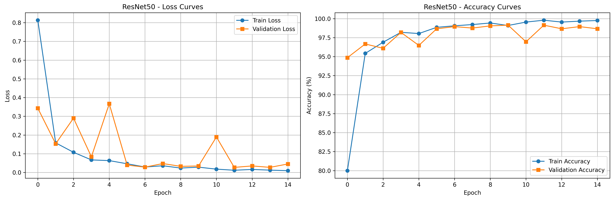
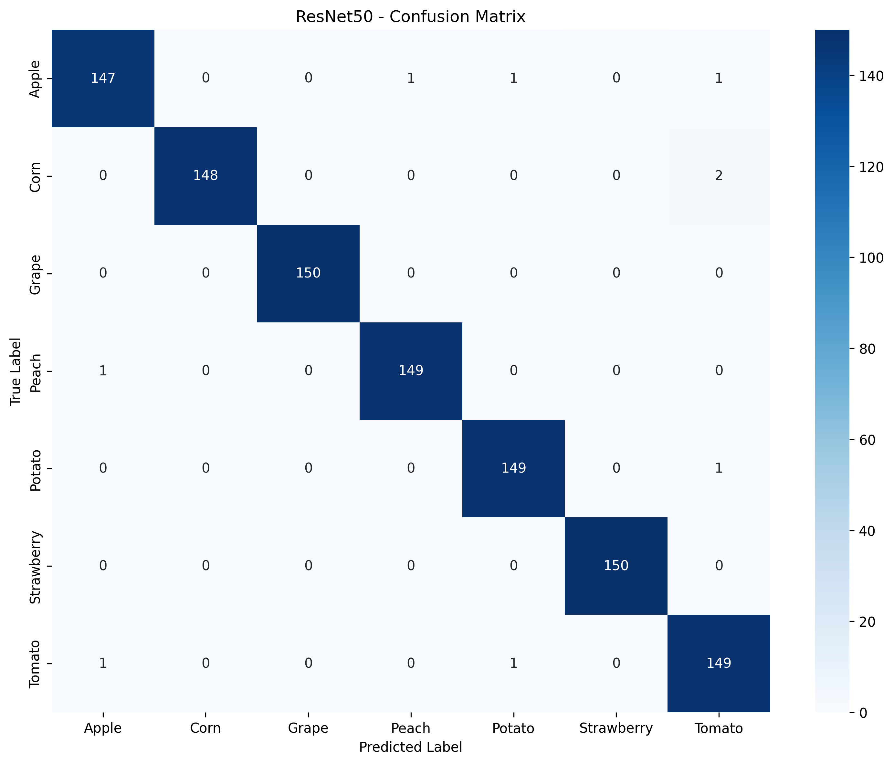

# Plant Species Classification using Transfer Learning

This project implements transfer learning on three state-of-the-art Convolutional Neural Network (CNN) architectures (AlexNet, VGG16, and ResNet50) to classify 7 different plant species from leaf images. 

## 🌟 Project Highlights
- **Comparative Benchmarking**: Direct performance comparison across three distinct CNN architectures of varying depth and complexity.
- **Robust Transfer Learning**: Utilizes pre-trained ImageNet weights, selectively fine-tuning classification heads while utilizing deep feature-extraction layers to dramatically reduce training time and prevent overfitting.
- **Dynamic Data Augmentation**: Implements real-time PyTorch transformations (rotations, flips, color jitter) to make the models resilient to real-world lighting, scaling, and orientation variances.
- **Automated Evaluation Pipeline**: Automatically generates side-by-side Learning Curves (Loss/Accuracy) and Confusion Matrices for deep analytical insights.

## Dataset

The dataset contains 7 classes of plant species:
- Apple
- Corn
- Grape
- Peach
- Potato
- Strawberry
- Tomato

## Requirements

Install the required packages:
```bash
pip install -r requirements.txt
```

## Pre-trained Models

Since model weights (`.pth` files) are too large for GitHub, you can download the trained models here and place them in the root directory:
- [Download ResNet50 Weights](#) <!-- TODO: Update link here -->
- [Download VGG16 Weights](#) <!-- TODO: Update link here -->
- [Download AlexNet Weights](#) <!-- TODO: Update link here -->

## Usage

### 1. Training the Models

To train all three models (AlexNet, VGGNet, and ResNet50) and generate evaluation metrics, run the main unified training script:
```bash
python plant_classification_train_model.py
```

### 2. Running Inference (Predictions)

To test a trained model on a specific image, use the inference script. By default, it loads the ResNet50 weights and evaluates a sample image:
```bash
python run_model.py
```
*Note: You can easily edit `run_model.py` to change the `image_path` or swap between loading the AlexNet, VGGNet, or ResNet50 `.pth` files.*

## Features

1. **Data Sampling**: Automatically samples 500 images per class (configurable) to keep training time reasonable
2. **Data Split**: 70% training, 30% testing with stratified splitting
3. **Transfer Learning**: 
   - Freezes pre-trained ImageNet weights
   - Replaces classification layers for 7-class classification
   - Trains only the new classification layers
4. **Three Models Evaluated**:
   - AlexNet
   - VGGNet (VGG16)
   - ResNet50
5. **Training Configuration**:
   - Batch size: 32
   - Learning rate: 0.001
   - Optimizer: Adam
   - Epochs: 10
   - Learning rate scheduler: StepLR (reduces LR by 0.1 every 5 epochs)
6. **Outputs**:
   - Learning curves (training/validation loss and accuracy) for each model
   - Confusion matrices for each model
   - Saved trained models (.pth files)
   - Classification reports

## 📊 Results & Comparative Analysis

By benchmarking these models, we can analyze the tradeoff between deep model complexity (ResNet50) and lightweight inference speed (AlexNet). The training pipeline automatically generates comparative visualizations to evaluate precision, recall, and convergence.

*(Pro Tip: To make your README really stand out, you can display your generated graphs right here by uncommenting these lines!)*
<!--  -->
<!--  -->

## Output Files Generated During Training

After running the training script, you'll get:
- **Graphs:** `AlexNet_learning_curves.png`, `VGGNet_learning_curves.png`, `ResNet50_learning_curves.png`
- **Confusion Matrices:** `AlexNet_confusion_matrix.png`, `VGGNet_confusion_matrix.png`, `ResNet50_confusion_matrix.png`
- **Saved Weights:** `AlexNet_plant_classifier.pth`, `VGGNet_plant_classifier.pth`, `ResNet50_plant_classifier.pth`

## Configuration

You can modify the following parameters in the training script:
- `SAMPLE_SIZE_PER_CLASS`: Number of images to sample per class (default: 500)
- `BATCH_SIZE`: Batch size for training (default: 32)
- `LEARNING_RATE`: Learning rate (default: 0.001)
- `NUM_EPOCHS`: Number of training epochs (default: 10)
- `TRAIN_RATIO`: Training data ratio (default: 0.7)

## Notes

- The script automatically detects available GPU and uses it if available
- Data augmentation is applied to training data (random flip, rotation, color jitter)
- All models use ImageNet pre-trained weights
- The script handles multiple folders for the same class (e.g., multiple Tomato folders)
